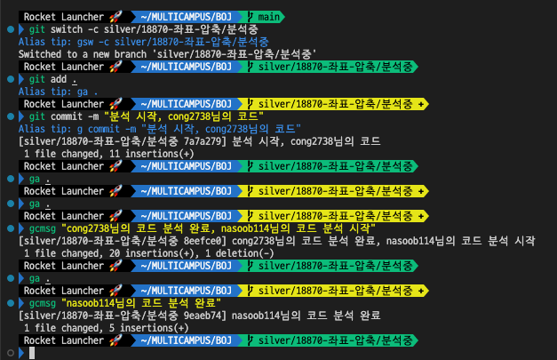

# 깃허브 액션을 활용한 백준허브 워크플로우

<br>

## 요약
`.github/workflows` 디렉토리에 아래 yaml 파일을 작성해 푸시하고 사용하면 된다. 이후 Notes 디렉토리에 자동으로 복사된 README.md 파일에 학습한 내용 기록.

<br>

## Motivation:
깃허브 `rebase -i` 커맨드와 `cherry-pick`으로 매번 다른 브랜치에서 변경 내용을 불러오는 방식으로 작업을 진행하다 보니, 에러도 잦고, 따라서 조심히 다뤄야 했고, 또 손이 많이 갔다. 그래서 그냥 Notes 디렉토리에 Push된 README.md 파일들을 복사해 수정하고 커밋/푸시하는 방식으로 진행했다. 

그러다 Github Actions에 대해 알게 되었고, 활용해 위 작업을 자동화했다.

<br>

## Github Actions
1. 저장소 베이스 디렉토리에 `.github/workflows` 라는 디렉토리를 만든다. 반드시 똑같은 이름이어야 한다.
2. 위 디렉토리 내에 yml 또는 yaml 확장자를 가진 파일을 만든다. 필자의 경우 `make_notes.yml`.
3. 아래 코드 내용을 붙여넣는다.
```yaml
name: Make Note Files

on:
  push:
    branches:
      - main

jobs:
  copy_files:
    runs-on: ubuntu-latest

    steps:
    - name: Checkout repository
      uses: actions/checkout@v3
      with:
        fetch-depth: 0

    - name: Create target directory if it doesn't exist
      run: |
        if [ ! -d "Notes" ]; then
          mkdir Notes
        fi

    - name: Copy README.md files
      run: |
        for file in $(git diff --name-only ${{ github.event.before }} ${{ github.sha }} | grep -E '^.+\/README\.md$'); do
          if [ ! -f "Notes/$file" ]; then
            mkdir -p "$(dirname "Notes/$file")"
            cp "$file" "Notes/$file"
          fi
        done

    - name: Commit and push if changes
      run: |
        git add Notes/*
        if [ -n "$(git status --porcelain)" ]; then
          git config user.name "GitHub Actions"
          git config user.email "github-actions[bot]@users.noreply.github.com"
          git commit -m "Update README.md files in Notes [ci skip]"
          git push origin main
        fi
```
4. push해 원격 저장소에 반영한다.

이제 백준허브에서 push 되는 README.md 파일들이 Notes 디렉토리에 복사될 것이다.  
베이스 디렉토리에 있는 README.md 파일은 복사되지 않는다.

출처: [ChatGPT](https://chat.openai.com/share/3cef9ae7-6a1c-490a-9fcb-5971d9647b2a)

<br>

---

# [Legacy] 깃허브 커맨드를 활용한 백준허브 워크플로우
> 부제: 백준허브로 코딩공부하는 방법

## 요약
1. 수정할 README.md 파일이 있는 문제에 해당하는 깃 브랜치 만들기
2. 수정 후 커밋 그리고 `git rebase -i` 커맨드로 해당 커밋 합치기
3. `git cherry-pick`으로 `main`브랜치에 필요한 커밋만 부분합병(?)하기

---

## Motivation:
필자는 백준으로 알고리즘 문제를 푼 뒤, 백준허브라는 크롬 익스텐션을 사용해 깃허브 저장소로 결과를 전송한다. 거기서 끝내지 않고 다른 코드를 보고 분석해 깃허브 저장소에 푸시되는 README.md 파일에 기록해놓는다. 그런데 내 제출 페이지를 방문할 때마다 백준허브가 활성화되면서 README.md 파일을 다시 푸시하면서, 이전해 기록해놓은 자료들이 사라져버린다. 이런 현상을 알아차리고 나서 내 제출 페이지를 방문할 때마다 일일이 복사해서 다시 붙여놓고 다시 커밋, 푸시해야 하는게 여간 번거로운 일이 아니다. 어떻게해야 효율적으로 백준허브 저장소를 관리할 수 있을까?

## 1. 수정할 README.md 파일이 있는 문제에 해당하는 깃 브랜치 만들기
문제를 풀면 깃허브 저장소에 해당 파일들이 푸시되고, 이를 `git pull origin main` 커맨드로 로컬 저장소로 가져올 수 있다. 
  
그 중 분석하고 싶은 문제에 해당하는 브랜치를 생성하고 해당 브랜치로 이동한다. 필자는 `git switch -c` 커맨드를 사용한다. 이후 README.md 파일을 수정하고 커밋한다.  



## 2. 수정 후 커밋 그리고 `git rebase -i` 커맨드로 해당 커밋 합치기
이 때, 여러개의 커밋이 발생할 수 있다. 한번에 코드 분석을 마치기는 만만하지 않다. 그리고 커밋하지 않으면 다른 브랜치로 이동하기 번거로워진다. 일단 부분적으로 완성된 부분을 커밋한 후 나중에 `git rebase -i HEAD~{합칠 커밋 개수}` 명령을 사용하여 합칠 수 있다. 다만 이 방법으로는 연속하는 커밋만 합칠 수 있어, 해당 브랜치 내에서는 다른 작업을 하지 않는 것이 좋다.  
먼저 합칠 커밋 개수를 확인하자:  
  
<br>
예시의 경우 3개이므로 `git rebase -i HEAD~3` 명령을 수행한다.  
  
<br>
아래와 같은 화면이 뜰 것이다:  
  
위와 같은 화면에서 가장 오래된 커밋을 제외한 나머지의 커밋에서 `pick`을 `s`로 바꾼다. `s`는 squash의 약자이다. 저장후 다음 페이지에서 커밋 메세지를 적을 수 있다.


`git log --oneline` 커맨드를 통해 확인 할 수 있다. 커밋 id를 복사해놓자.  


## 3. `git cherry-pick`으로 `main`브랜치에 필요한 커밋만 부분합병(?)하기
다시 `main` 브랜치로 돌아가 `git cherry-pick {커밋 id}` 명령을 입력하면 해당 내용을 `main` 브랜치로 가져올 수 있다. `git push -u origin main` 명령으로 마무리한다.

Before:  


After:  


작업 완료 후 브랜치명 변경:  


앞으로 백준허브가 내 저장소의 내용을 덮어 쓸 경우, 해당 브랜치로 이동하여 커밋 id를 복사한 뒤 cherry-pick하여 해당 부분만 덮어쓸 수 있다.

---